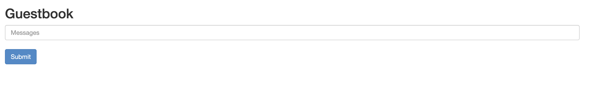

## Get your hands dirty with K3D 
Now that we have a running cluster creating by K3D, it's time to make our very first service.   
The example that I chosen was from https://github.com/nigelpoulton/k8s-sample-apps (A more PC example can be found from https://kubernetes.io/docs/tutorials/stateless-application/guestbook/)
This repo proposed several example apps, and this is the simplest one. 

|Name | Description | Notable Features Used | Complexity Level|
------------- | ------------- | ------------ | ------------ | 
|[Guestbook](guestbook/) | PHP app with Redis | Deployment, Service | Beginner |
|[WordPress](mysql-wordpress-pd/) | WordPress with MySQL | Deployment, Persistent Volume with Claim | Beginner|
|[Cassandra](cassandra/) | Cloud Native Cassandra | Daemon Set, Stateful Set, Replication Controller | Intermediate

## What's in this Guestbook application 
This is an PHP application which allows register strings. 
It looks like this    
The string will then be kept in a mini Redis cluster. 

In the actual deployment, there are a frontend and a Redis cluster consisted with a leader and a follower. 


## Before deployment 
Let's prepare for the deployment with a dedicated namespace. I find this a nice practice before deployment a group of depending services.   
This allows us to manage the ACL, etc much more easily lately.  
To create a namespace named `guestbook`, we use 
```shell
kubectl create namespace guestbook
``` 
Then switch the context to use this namespace by defaut:   
```shell 
kubectl config set-context --current --namespace guestbook
```
At the next steps, we will be able to work in this namespace with dedicated informations(pods, deployments, services, etc) for this tutorial. 

## Redis deployment 
### The Redis leader
#### Deployment
To begin with the Redis part, we will create a redis leader by using this file `redis-leader-deployment.yaml`  
```yaml
# SOURCE: https://cloud.google.com/kubernetes-engine/docs/tutorials/guestbook
apiVersion: apps/v1
kind: Deployment
metadata:
  name: redis-leader
  labels:
    app: redis
    role: leader
    tier: backend
spec:
  replicas: 1
  selector:
    matchLabels:
      app: redis
  template:
    metadata:
      labels:
        app: redis
        role: leader
        tier: backend
    spec:
      containers:
      - name: leader
        image: "docker.io/redis:6.0.5"
        resources:
          requests:
            cpu: 100m
            memory: 100Mi
        ports:
        - containerPort: 6379
```
Then type in your terminal with `kubectl apply -f redis-leader-deployment.yaml` to politely ask our K3D cluster to deploy it.    
Then checkout the pods with `kubectl get pods`   
Then you will see the pod is creating   
```shell
NAME                           READY   STATUS              RESTARTS   AGE
redis-leader-857d99cc8-8dtr4   0/1     ContainerCreating   0          6s
```
A few moments later, we will see that the pod is ready  
```shell 
NAME                           READY   STATUS    RESTARTS   AGE
redis-leader-857d99cc8-8dtr4   1/1     Running   0          15s
```


#### Service 
A deployment always comes with a service for access the pods wisely. 
Create this file to make the service for our redis leader `redis-leader-service.yaml`   
```yaml
# SOURCE: https://cloud.google.com/kubernetes-engine/docs/tutorials/guestbook
apiVersion: v1
kind: Service
metadata:
  name: redis-leader
  labels:
    app: redis
    role: leader
    tier: backend
spec:
  ports:
  - port: 6379
    targetPort: 6379
  selector:
    app: redis
    role: leader
    tier: backend
```
Then you can apply it with `kubectl apply -f redis-leader-service.yaml`    
Check the service with `kubectl get service` 
```shell
kubectl get services
NAME           TYPE        CLUSTER-IP    EXTERNAL-IP   PORT(S)    AGE
redis-leader   ClusterIP   10.43.18.93   <none>        6379/TCP   6s
```


### The redis follower 
#### Deployment 
As the leader but with slightly different config. 
Let's create `redis-follower-deployment.yaml`  
```yaml
# SOURCE: https://cloud.google.com/kubernetes-engine/docs/tutorials/guestbook
apiVersion: apps/v1
kind: Deployment
metadata:
  name: redis-follower
  labels:
    app: redis
    role: follower
    tier: backend
spec:
  replicas: 2
  selector:
    matchLabels:
      app: redis
  template:
    metadata:
      labels:
        app: redis
        role: follower
        tier: backend
    spec:
      containers:
      - name: follower
        image: gcr.io/google_samples/gb-redis-follower:v2
        resources:
          requests:
            cpu: 100m
            memory: 100Mi
        ports:
        - containerPort: 6379
```
We create 2 replicas for having 2 followers.  
Apply the yaml file `kubectl apply -f redis-follower-deployment.yaml`  and check the deployment with `kubectl get pods` 
```shell 
NAME                           READY   STATUS              RESTARTS   AGE
redis-leader-857d99cc8-8dtr4   1/1     Running             0          93s
redis-follower-9dc7f6964-mcgbn    0/1     ContainerCreating   0          12s
redis-follower-9dc7f6964-dpc2b    1/1     Running             0          12s
```

#### Service 
Now create the service with `redis-follower-service.yaml`   
```yaml
# SOURCE: https://cloud.google.com/kubernetes-engine/docs/tutorials/guestbook
apiVersion: v1
kind: Service
metadata:
  name: redis-follower
  labels:
    app: redis
    role: follower
    tier: backend
spec:
  ports:
    # the port that this service should serve on
  - port: 6379
  selector:
    app: redis
    role: follower
    tier: backend
```
Apply and check the service 
```shell
kubectl apply -f redis-follower-service.yaml
kubectl get service
```

```shell
NAME              TYPE        CLUSTER-IP     EXTERNAL-IP   PORT(S)    AGE
redis-leader      ClusterIP   10.43.18.93    <none>        6379/TCP   89s
redis-follower    ClusterIP   10.43.210.57   <none>        6379/TCP   29s
```

## Frontend 
### Deployment 
Now let's move to the frontend part.   
This is the configuration yaml file `frontend-deployment.yaml`   
```yaml
# SOURCE: https://cloud.google.com/kubernetes-engine/docs/tutorials/guestbook
apiVersion: apps/v1
kind: Deployment
metadata:
  name: frontend
spec:
  replicas: 3
  selector:
    matchLabels:
        app: guestbook
        tier: frontend
  template:
    metadata:
      labels:
        app: guestbook
        tier: frontend
    spec:
      containers:
      - name: php-redis
        image: gcr.io/google_samples/gb-frontend:v5
        env:
        - name: GET_HOSTS_FROM
          value: "dns"
        resources:
          requests:
            cpu: 100m
            memory: 100Mi
        ports:
        - containerPort: 80
```
Apply it with `kubectl apply -f frontend-deployment.yaml`
Let's see the pods with `kubectl get pods -l app=guestbook -l tier=frontend` 
```shell
NAME                       READY   STATUS    RESTARTS   AGE
frontend-f7d9c57d4-p9dm8   1/1     Running   0          21s
frontend-f7d9c57d4-vgk2v   1/1     Running   0          21s
frontend-f7d9c57d4-trqkm   1/1     Running   0          21s
```
Since we have defined our namespace, we can alsow omit the `-l app=guestbook`  which are selectors to choose the coresponding pods.  

### Service 
Now let's create a service for the frontend with `frontend-service.yaml`  
```yaml 
# SOURCE: https://cloud.google.com/kubernetes-engine/docs/tutorials/guestbook
apiVersion: v1
kind: Service
metadata:
  name: frontend
  labels:
    app: guestbook
    tier: frontend
spec:
  # if your cluster supports it, uncomment the following to automatically create
  # an external load-balanced IP for the frontend service.
  # type: LoadBalancer
  #type: LoadBalancer
  ports:
    # the port that this service should serve on
  - port: 80
  selector:
    app: guestbook
    tier: frontend
```
Apply it as always `kubectl apply -f frontend-service.yaml`  
And check the service created `kubectl get services` 
```shell
NAME            TYPE        CLUSTER-IP     EXTERNAL-IP   PORT(S)        AGE
redis-leader    ClusterIP   10.43.18.93    <none>        6379/TCP       3m22s
redis-follower  ClusterIP   10.43.210.57   <none>        6379/TCP       2m22s
frontend        NodePort    10.43.120.61   <none>        80:32494/TCP   2s
```

## Test our application 
Now we can test our application by using port-forwarding:  
```shell 
kubectl port-forward svc/frontend 8080:80
```
If you use a remote server like me for K3D, you may want to add the address of the server with port-forwarding: 
```shell
kubectl port-forward svc/frontend 8080:80 --address 0.0.0.0 # or the ip of your server 
```
```shell 
Forwarding from 0.0.0.0:8080 -> 80
Handling connection for 8080
Handling connection for 8080
```

## Scale the frontend 
### Scale up
The biggest advantage to use K8S is the capability of scaling.  
We can use `kubectl scale deployment frontend --replicas=5` to scale the frontend. 
```shell 
deployment.apps/frontend scaled
```
Then we check the pods to see if we have 5 replicas for our frontend `kubectl get pods -l tier=frontend`  
```shell
NAME                       READY   STATUS    RESTARTS   AGE
frontend-f7d9c57d4-p9dm8   1/1     Running   0          145m
frontend-f7d9c57d4-vgk2v   1/1     Running   0          145m
frontend-f7d9c57d4-trqkm   1/1     Running   0          145m
frontend-f7d9c57d4-rxftf   1/1     Running   0          68s
frontend-f7d9c57d4-xhfw9   1/1     Running   0          68s
``` 

Hooray! 

### Scale down 
Now let's give our poor little server a break by scale down the app `kubectl scale deployment frontend --replicas=2`  and check the pods again `kubectl get pods -l tier=frontend`  
```shell 
NAME                       READY   STATUS    RESTARTS   AGE
frontend-f7d9c57d4-p9dm8   1/1     Running   0          146m
frontend-f7d9c57d4-vgk2v   1/1     Running   0          146m
``` 
Now we can see that we have only two pods for frontend left. 


## Expose the service 
With K3D, we have two ways to expose the service: via ingress and via Nodeport. 
At the following part, I will show you how to expose the service in K3D. 

### Using NodePort 
The simplest way to expose the service is to use NodePort.
If you don't have the port mapping for the K3D Loadbalancer, then you can add a port for it. 
Suppose that you don't have 8082 which is the port you want for your app. You can add the port mapping with 
```shell
k3d cluster edit mycluster --port-add 8082:80@loadbalancer
```
Then you can simply change the frontend service with 
```shell
kubectl edit svc frontend 
```
This gives you the config for your service 
```yaml
apiVersion: v1
kind: Service
metadata:
  annotations:
    kubectl.kubernetes.io/last-applied-configuration: >
      {"apiVersion":"v1","kind":"Service","metadata":{"annotations":{},"labels":{"app":"guestbook","tier":"frontend"},"name":"frontend","namespace":"guestbook"},"spec":{"ports":[{"port":80}],"selector":{"app":"guestbook","tier":"frontend"},"type":"NodePort"}}
  creationTimestamp: 2023-03-11T21:06:54Z
  labels:
    app: guestbook
    tier: frontend
  managedFields:
    - apiVersion: v1
      fieldsType: FieldsV1
      fieldsV1:
        f:metadata:
          f:annotations:
            .: {}
            f:kubectl.kubernetes.io/last-applied-configuration: {}
          f:labels:
            .: {}
            f:app: {}
            f:tier: {}
        f:spec:
          f:externalTrafficPolicy: {}
          f:internalTrafficPolicy: {}
          f:ports:
            .: {}
            "k:{\"port\":80,\"protocol\":\"TCP\"}":
              .: {}
              f:port: {}
              f:protocol: {}
              f:targetPort: {}
          f:selector: {}
          f:sessionAffinity: {}
      manager: kubectl-client-side-apply
      operation: Update
      time: 2023-03-11T21:06:54Z
    - apiVersion: v1
      fieldsType: FieldsV1
      fieldsV1:
        f:spec:
          f:ports:
            "k:{\"port\":80,\"protocol\":\"TCP\"}":
              f:nodePort: {}
          f:type: {}
      manager: Go-http-client
      operation: Update
      time: 2023-03-11T21:13:29Z
  name: frontend
  namespace: guestbook
  resourceVersion: "2542766"
  uid: b50c1161-08f1-4b00-b7b1-0df41ad160f9
spec:
  clusterIP: 10.43.120.61
  clusterIPs:
    - 10.43.120.61
  internalTrafficPolicy: Cluster
  ipFamilies:
    - IPv4
  ipFamilyPolicy: SingleStack
  ports:
    - port: 80
      protocol: TCP
      targetPort: 80
  selector:
    app: guestbook
    tier: frontend
  sessionAffinity: None
  type: ClusterIP
status:
  loadBalancer: {}
```
Now you can edit it by changing the spec part to 
```yaml
...
spec:
  clusterIP: 10.43.120.61
  clusterIPs:
    - 10.43.120.61
  internalTrafficPolicy: Cluster
  ipFamilies:
    - IPv4
  ipFamilyPolicy: SingleStack
  ports:
    - nodePort: 8082
      port: 80
      protocol: TCP
      targetPort: 80
  selector:
    app: guestbook
    tier: frontend
  sessionAffinity: None
  type: NodePort
status:
  loadBalancer: {}
```
You just need to add `nodePort: 8082` and change the type from `ClusterIP` to `NodePort` 

Now you can try to access the service from the host of K3D with `http://host-ip:8082`


### Using Ingress 
K3D's documentation recommands this way. I was a little bit confused at the beginning to get it work.   
But it's as easy as the NodePort method.   

For the service, you just need to keep it to ClusterIP type and give it a port mapping 
```yaml 
apiVersion: v1
kind: Service
metadata:
  annotations:
    kubectl.kubernetes.io/last-applied-configuration: >
      {"apiVersion":"v1","kind":"Service","metadata":{"annotations":{},"labels":{"app":"guestbook","tier":"frontend"},"name":"frontend","namespace":"guestbook"},"spec":{"ports":[{"port":80}],"selector":{"app":"guestbook","tier":"frontend"},"type":"NodePort"}}
  creationTimestamp: 2023-03-11T21:06:54Z
  labels:
    app: guestbook
    tier: frontend
  managedFields:
    - apiVersion: v1
      fieldsType: FieldsV1
      fieldsV1:
        f:metadata:
          f:annotations:
            .: {}
            f:kubectl.kubernetes.io/last-applied-configuration: {}
          f:labels:
            .: {}
            f:app: {}
            f:tier: {}
        f:spec:
          f:externalTrafficPolicy: {}
          f:internalTrafficPolicy: {}
          f:ports:
            .: {}
            "k:{\"port\":80,\"protocol\":\"TCP\"}":
              .: {}
              f:port: {}
              f:protocol: {}
              f:targetPort: {}
          f:selector: {}
          f:sessionAffinity: {}
      manager: kubectl-client-side-apply
      operation: Update
      time: 2023-03-11T21:06:54Z
    - apiVersion: v1
      fieldsType: FieldsV1
      fieldsV1:
        f:spec:
          f:ports:
            "k:{\"port\":80,\"protocol\":\"TCP\"}":
              f:nodePort: {}
          f:type: {}
      manager: Go-http-client
      operation: Update
      time: 2023-03-11T21:13:29Z
  name: frontend
  namespace: guestbook
  resourceVersion: "2542766"
  uid: b50c1161-08f1-4b00-b7b1-0df41ad160f9
spec:
  clusterIP: 10.43.120.61
  clusterIPs:
    - 10.43.120.61
  internalTrafficPolicy: Cluster
  ipFamilies:
    - IPv4
  ipFamilyPolicy: SingleStack
  ports:
    - port: 80
      protocol: TCP
      targetPort: 80
  selector:
    app: guestbook
    tier: frontend
  sessionAffinity: None
  type: ClusterIP
status:
  loadBalancer: {}
```
Then you can create an ingress to access the service with `guestbook-ingress.yaml`  
```yaml 
# apiVersion: networking.k8s.io/v1beta1 # for k3s < v1.19
apiVersion: networking.k8s.io/v1
kind: Ingress
metadata:
  name: nginx
  annotations:
    ingress.kubernetes.io/ssl-redirect: "false"
spec:
  rules:
  - http:
      paths:
      - path: /
        pathType: Prefix
        backend:
          service:
            name: guestbook
            port:
              number: 8082
```
The most important part is to specify the app to `guestbook`. This is the `app` selector we defined for the frontend service. 
```yaml
        backend:
          service:
            name: guestbook
            port:
              number: 8082
```
The port number here should be the external port to access the service, and we just tell the LoadBalancer to find the service named guestbook. 

Then just type `kubectl apply -f guestbook-ingress.yaml` and you are fine to go with your deployment.

## Clean up
The simplest way to clean up is with the namespace 
```shell
kubectl delete namespace guestbook
```

A more complicated way it's to purge the pods and the services 
```shell
kubectl delete deployment -l app=redis
kubectl delete service -l app=redis
kubectl delete deployment frontend
kubectl delete service frontend
```
And something like 
```shell
deployment.apps "redis-follower" deleted
deployment.apps "redis-leader" deleted
deployment.apps "frontend" deleted
service "frontend" deleted
```
will show up. 

If you type `kubectl get pods`, you can see that you cleansed everything. 


## References
https://kubernetes.io/docs/tutorials/stateless-application/guestbook/ 
https://k3d.io/v5.4.6/usage/exposing_services/ 
