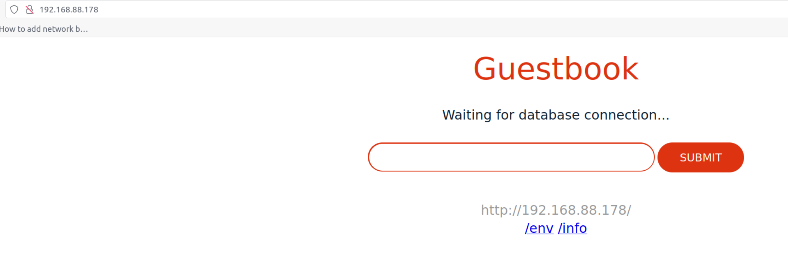

## LoadBalancer and load balancer - They are not the same thing!

The terms LoadBalancer and load balancer are often used interchangeably, but they can have different meanings depending on the context.

In general, a load balancer is a device or software that distributes network traffic across multiple servers or nodes in a network. This can improve the performance and availability of the network by ensuring that no single server or node is overloaded with traffic.

A LoadBalancer, on the other hand, is a specific type of load balancer that is used in Kubernetes environments. In Kubernetes, a LoadBalancer is a service that provides external access to a set of pods in a deployment. It typically uses a cloud provider's load balancing service to distribute traffic across the pods.

So, while a load balancer can refer to any device or software that distributes network traffic, a LoadBalancer specifically refers to a service in Kubernetes that provides external access to a set of pods in a deployment.

## LoadBalancer in K3S with MetalLB

K3S is a lightweight Kubernetes distribution designed for use in resource-constrained environments. One of the features of Kubernetes that K3S supports is the LoadBalancer service. This allows traffic to be distributed across multiple pods in a deployment, providing high availability and fault tolerance.

However, in order to use the LoadBalancer service in K3S, you need to have a LoadBalancer implementation that is compatible with the K3S environment. One popular option is MetalLB.

MetalLB is a software LoadBalancer implementation that runs on Kubernetes. It is designed to integrate with Kubernetes services and provide a LoadBalancer implementation that is easy to configure and use. In K3S, MetalLB can be used to provide LoadBalancer services for your applications.

To use MetalLB in K3S, you first need to install the MetalLB controller and the MetalLB speaker. This can be done using the kubectl command-line tool. Once installed, you can configure MetalLB to use a particular IP address range for LoadBalancer services. This IP address range needs to be within the same subnet as the IP address of the K3S node that will be hosting the LoadBalancer service.

Once MetalLB is configured, you can create a LoadBalancer service in K3S as you would in a standard Kubernetes environment. This will create a LoadBalancer IP address that can be used to access your application. Traffic will be automatically distributed across the pods in your deployment, providing high availability and fault tolerance.

In summary, using the LoadBalancer service in K3S with MetalLB provides an easy-to-use solution for distributing traffic across multiple pods in a deployment. With MetalLB, you can quickly and easily set up LoadBalancer services in K3S, providing high availability and fault tolerance for your applications.

## Layer 2 and BGP in MetalLB

MetalLB supports two modes of operation: Layer 2 and BGP.

In Layer 2 mode, MetalLB is configured to act as a Layer 2 load balancer. This means that it will use ARP to announce the IP address of the LoadBalancer service to the local network. This mode is useful in environments where BGP is not available or is not desired.

In BGP mode, MetalLB is configured to use the Border Gateway Protocol (BGP) to announce the IP address of the LoadBalancer service to the network. This mode is useful in environments where BGP is available and provides a more scalable and flexible solution than Layer 2 mode.

In both modes, MetalLB can be configured to use a specific IP address range for LoadBalancer services. This allows you to control the IP addresses that are used for LoadBalancer services and ensure that they are compatible with your network configuration.

To choose between Layer 2 and BGP mode in MetalLB, you need to consider your specific network environment and requirements. If you have access to BGP and want a more scalable and flexible solution, BGP mode may be the better choice. If BGP is not available or you prefer a simpler solution, Layer 2 mode may be the better choice.


## What did MetalLB actually do?
MetalLB assigns an IP address to a LoadBalancer service from the address range that you specify. This IP address is then used to access the service. 
Then it broadcasts the IP address of the LoadBalancer service to the local network using ARP (Yep, just yelling to everyone in the same network).   
This allows traffic to be correctly routed to the service, providing high availability and fault tolerance for your applications.   

With MetalLB, instead of using NodePort, or Ingress which onkly works with HTTP/HTTPS traffic, you can use LoadBalancer service to expose your application to the outside world, thus making the effect of cloud-provisioned Load Balancer.


## How to set up MetalLB in K3S

It’s easy to setup MetalLB. Historically we use helm, but now it’s recommended to use Manifest: 

To install MetalLB using a manifest in K3S, follow these steps:

1. Use the official Manifest or create a new file named `metallb.yaml` and paste the following contents into the file:

```Shell
kubectl apply -f https://raw.githubusercontent.com/metallb/metallb/v0.13.9/config/manifests/metallb-native.yaml
```


2. Create a IP pool  and apply it.   
  Basically the `addresses` will be a list of IPs that are available from your home router/ your DHCP server. 

```YAML
apiVersion: metallb.io/v1beta1
kind: IPAddressPool
metadata:
  name: first-pool
  namespace: metallb-system
spec:
  addresses:
  - 192.168.88.176-192.168.88.180
```
 Apply the manifest using the `kubectl apply` command:
```Shell
kubectl apply -f metallb.yaml
```


This will create a new namespace named `metallb-system` and deploy the MetalLB controller and speaker as Kubernetes objects within that namespace. Once the controller and speaker are running, you can create LoadBalancer services in K3S and MetalLB will automatically assign an IP address from the specified IP address range.

Note that you may need to modify your network configuration to allow traffic to be routed to the LoadBalancer IP address. This may involve configuring NAT or firewall rules on your network router or gateway.

3. Advertise your IP pool  with Layer2 mode
Layer 2 advertisement is used in MetalLB to announce the IP address of the LoadBalancer service to the local network using ARP.   
This is necessary in Layer 2 mode, which is used when BGP is not available or not desired.   
By announcing the IP address of the LoadBalancer service to the local network, MetalLB ensures that traffic is correctly routed to the service, providing high availability and fault tolerance for your applications.
```YAML 
apiVersion: metallb.io/v1beta1
kind: L2Advertisement
metadata:
  name: first-pool-advertisement
  namespace: metallb-system
spec:
  ipAddressPools:
  - first-pool
```


Now you can create LoadBalancer services in K3S and MetalLB will automatically assign an IP address from the specified IP address range.
Let's try our example with guestbook app. If you didn't see the example, you can find it here: [Deploy guestbook example in K3D](../guest_book)
This time we will use the `LoadBalancer` service type.   
```YAML
kind: Service
apiVersion: v1
metadata:
  name: guestbook
  namespace: guestbook
  labels:
    app: guestbook
spec:
  ports:
  - port: 80
    targetPort: http-server
  selector:
    app: guestbook
  type: LoadBalancer
```
Then we will see an IP is assigned to our service by MetalLB.   



## References

1. [https://metallb.universe.tf/installation/](https://metallb.universe.tf/installation/)

2. [https://www.reddit.com/r/homelab/comments/mvjc0f/metallb_and_traefik_for_a_home_kubernetes_cluster/](https://www.reddit.com/r/homelab/comments/mvjc0f/metallb_and_traefik_for_a_home_kubernetes_cluster/)

3. https://opensource.com/article/20/7/homelab-metallb 