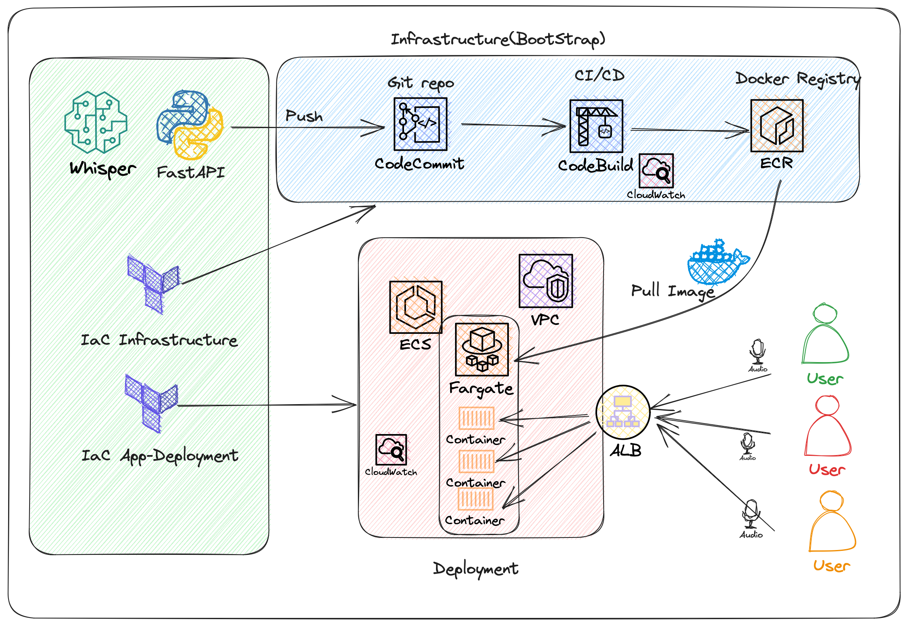
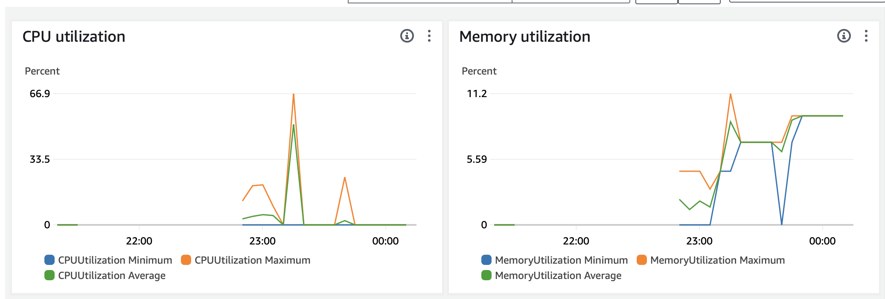
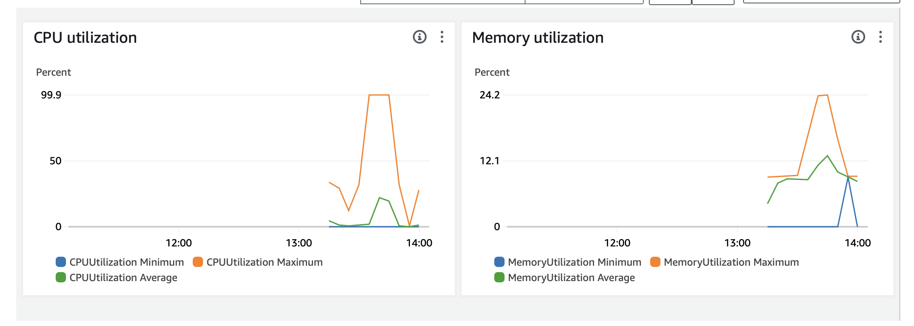

## Introduction  
Whisper is a STT (Speech to Text) model developed by [OPENAI](https://openai.com/research/whisper). It's a powerful model that can convert human speech into text. Friend of mine encoutered this project as an job interview task with IaC using Terraform so I get the idea to do it on my own and I find it interesting to deploy it on AWS Fargate. I chose Fargate because of the highly optimized version of it doesn't require GPUs. In this post, I will share my journey to this final solution and show you how to deploy it.   
All the code is available on [Github](https://github.com/wang-haoxian/whisper-terraform-aws-Fargate) and you can use it to deploy the model on your own AWS account.

## Prerequisites 
- AWS CLI configured
- Terraform with Terraform Cloud (or local state if you prefer) configured
- Docker installed

If you don't have any experience on Terraform, you can use the official tutorial to get started: [Getting Started with Terraform](https://learn.hashicorp.com/tutorials/terraform/install-cli?in=terraform/aws-get-started) with AWS Provider. 

## Interpretation of the task  
Due to the confidentiality of the task, I can't share the original task. However, I can share the main points of the task. The task is to serve STT model to replace the previous outsourced service. The model is expected to serve 100 users in a call center for post-call analytics and we should expect X10 users in the future.    
My understanding on this task is:   
- This is not about the concurrency of the model. We don't need real-time processing, so we can use batch processing.   
- The number of users is not a significant factor for the service, but the number of audios generated and the processing time for each document. (For example, we want to have the transcriptions of all our last weeks calls to have insights in the weekly meetings this monday, that means the time window to process all the files before monday, so for the files of Friday we will have to process them during the weekend, without taking consideration of the time that analytics team should take). 
- The model is not expected to be used by the public, so we don't need to worry about the security of the model.(At least for this version, we can assume that we only use the model in a secure environment)   
- The cost should be minimized. As long as we can optimize the model to use the least resources, we can use the cheapest service instead of the most powerful one with GPUs.   
- The model should be scalable. We should be able to scale the model to serve more users in the future.  
- We can create S3 buckets to store the audio files and the results, but we don't have to since the end user of the service(the analytics Team) may have already had a solution for this. 
- There are no limit on the choice of the model. We can use any model as long as it can serve the purpose. But we should be able to evaluate the model with some baseline metrics.(e.g. WER, CER, etc. But this is not the main point of the task) 
- The Diarisation is not mentionned but important in the multi-party communications like telephones, but that should be another project since we are talking about another ML module. 

### Reference of solutions on the market 
In France, I have encountered a few companies that provide STT services. I think it's interesting to check out [AlloMedia](https://www.allo-media.net/), a company that provides STT services for call centers. We can be inspired by their solutions.

## Investigation on Whisper and its deployment 
### Frameworks and Libraries 
There are several possible frameworks to use Whisper model, mainly: 

- [OpenAI official](https://github.com/openai/whisper) The official OpenAI implementation 
- [Whisper.CPP](https://github.com/ggerganov/whisper.cpp) The C++ implementation of the model 
- [Transformers](https://huggingface.co/openai/whisper-large-v3) The Huggingface implementation of the model in its transformers library.
- [Faster Whisper](https://github.com/systran/faster-whisper) which converts the model to [CTranslate2](https://github.com/OpenNMT/CTranslate2) format to optimize the model.

There is a benchmark of these implementations on [this page](https://github.com/SYSTRAN/faster-whisper/blob/master/README.md) and I take some of the information here: 

### Large-v2 model on GPU

| Implementation | Precision | Beam size | Time | Max. GPU memory | Max. CPU memory |
| --- | --- | --- | --- | --- | --- |
| openai/whisper | fp16 | 5 | 4m30s | 11325MB | 9439MB |
| faster-whisper | fp16 | 5 | 54s | 4755MB | 3244MB |
| faster-whisper | int8 | 5 | 59s | 3091MB | 3117MB |

*Executed with CUDA 11.7.1 on a NVIDIA Tesla V100S.*

### Small model on CPU

| Implementation | Precision | Beam size | Time | Max. memory |
| --- | --- | --- | --- | --- |
| openai/whisper | fp32 | 5 | 10m31s | 3101MB |
| whisper.cpp | fp32 | 5 | 17m42s | 1581MB |
| whisper.cpp | fp16 | 5 | 12m39s | 873MB |
| faster-whisper | fp32 | 5 | 2m44s | 1675MB |
| faster-whisper | int8 | 5 | 2m04s | 995MB |

*Executed with 8 threads on a Intel(R) Xeon(R) Gold 6226R.*

As we can see, the faster-whisper implementation is the most optimized one. It's interesting to use this implementation for our deployment.

This is why I chose to use CPU and Fargate. After some tests, I found that the base model is very optimized and can be used on CPU and we can get the result in a reasonable time without the cost of quality. 

The code to serve the model is very simple, we can use the following code to serve the model: 

```python
from faster_whisper import WhisperModel

model_size = "large-v3"

# Run on GPU with FP16
model = WhisperModel(model_size, device="cuda", compute_type="float16")

# or run on GPU with INT8
# model = WhisperModel(model_size, device="cuda", compute_type="int8_float16")
# or run on CPU with INT8
# model = WhisperModel(model_size, device="cpu", compute_type="int8")

segments, info = model.transcribe("audio.mp3", beam_size=5)

print("Detected language '%s' with probability %f" % (info.language, info.language_probability))

for segment in segments:
    print("[%.2fs -> %.2fs] %s" % (segment.start, segment.end, segment.text))
```

As you can see, the code is very simple and we can use it to serve the model. 

### Possible Solutions on AWS 
There are several possible way to deploy the model on AWS, mainly:
- EC2: We can deploy the model on EC2 and use the autoscaling group to scale the model.
- Lambda: We can deploy the model on Lambda and use the API Gateway to serve the model.
- Fargate: We can deploy the model on Fargate and use the ECS to serve the model.
- SageMaker: We can deploy the model on SageMaker and use the endpoint to serve the model.
- EKS: We can deploy the model on EKS and use the Kubernetes to serve the model.

I chose to use Fargate because it's the most optimized solution for our case. We don't need GPUs and we don't need to worry about the infrastructure. We can use the Fargate to serve the model and we can use the ECS to scale the model.     

Let's still checkout the pros and cons of each solution:
| Solution | Pros | Cons |
| --- | --- | --- |
| EC2 | Full control of the infrastructure | Need to manage the infrastructure and expensive when using GPU |
| Lambda | Serverless | Limited to 15 minutes and no GPU |
| Fargate | Serverless | No GPU |
| SageMaker | Managed service | Expensive |
| EKS | Full control of the infrastructure | Need to manage the infrastructure |

## Overview of the solution 
I draw the pipeline of the deployment as follows: 
  

We can expect three parts in the deployment:
- Codes 
  - The Python code for model serving code: The code to serve the model.
  - The Terraform code for infrastructure: The code to deploy the infrastructure.
- The infrastructure part: The infrastructure of code and CI/CD pipeline. This part is rather static and normally in the organization, it's managed by the DevOps team or the Infra team. And it's not the main part of the task and not necessary to be done with AWS. It can be Github Actions, Gitlab CI, Jenkins, etc.
- The model serving part: The model is served by the Fargate and the ECS. We can use the ECS to scale the model.

## Python Implementation
### Development details

- Python Project management: Poetry

- Model Framework: CTranslate2 for faster-whisper 

- Model size: Base 

- API Framework: FastAPI with Swagger UI and OpenAPI support 

- Model is downloaded when the web server is loaded (Not the best practice)
- An endpoint `/transcribe` for transcription  
- A health check `/healthz` is exposed for healthcheck ( for the sake of time, no model status check is implemented in this version)  it’s just a hook to see if the server responds  

- A dockerfile with docker-compose is created for building the image. And to launch it easily without typing long commands for dev purpose. 

- The docker compose file has limited CPU and memory to help with resources provisioning 

- .gitignore and .dockerignore are added for not including unwanted files in docker building process or in git.   

- The repo coexists with terraform codes, in reality they should be either separated or as submodules.   

- Formatting and linting:    
  - Black 
  - Pylint 
  - MyPy 
  - isort 

- Pydantic is used to make schemes for the API 

- A makefile is created for handy commands for testing 


## Terraform Implementation 
I have no previous experience on terraform except several runs with the official tutorials. I learnt during the project. To begin with, I took 
[GitHub - kayvane1/terraform-aws-huggingface-deploy](https://github.com/kayvane1/terraform-aws-huggingface-deploy/tree/master)
to get inspired. ChatGPT was used to help me understand quickly the syntax and make sample codes based on my needs, but mostly I use the official documentation.

### Terraform cloud
In this project I use terraform cloud all the time to simulate an env for collaboration as team (shared secrets, states, etc) It could be S3 backend or whatever backend supported by Terraform 

### Development details 
#### Boostrap

The project is modularized to four modules, instead of just a file. 

I consider this part as basic infrastructure that is used around the whole infrastructure. It should be easily tested one by one. 

there are four modules: 
1. Code Commit 
2. Code Build 
3. ECR 
4. IAM (to be put on corresponding modules instead of being an independent module) 

#### App Deployment

In contrary to the bootstrap part, I think this part is much more exclusive to the app. So I put every components in a single `ecs` module with alb.tf, [main.tf](http://main.tf), etc. 


#### Resources Estimation

Based on the local runs, I begin with 

##### Take 1

- 2 CPUs + 4GB
- In fact only 65 of 2 CPU and 11% of RAM was used
    
    
    
- So reduced to 1 CPU + 2GB but it’s not sufficient can caused the service to stop

##### Take2

- 1 CPU + 2GB 



- This cause the container to be killed often 

##### Final choice

- 2 CPU + 4 GB of RAM should be ok but we need further stress test 

##### ALB strategy   
I use ALB's target group for autoscaling the service. The desired number was set to 3 and be able to scale to 0. The minimum health percent of app was set to 50 to trigger the scale in.  

## Thoughts on potential improvements 
### Security

- https (even for internal communication - zero trust) + dedicated domain name (if exposed to the internet, if it’s called by enduser’s PC, not sure what the users look like) + with IP whitelist to improve security
- dev/stage/prod env separation
- Finer grain RBAC

### Scalability

- Automatic Target Weights (ATW) → weighted lb. Combine different strategies with metrics to make the scaling efficiently or Least outstanding requests
- stress test
- Over-Provisioning
- Fine-Tune threshold for scaling based on metrics
- Rate Limit in app
- Queuing

### Efficiency

- Improve configurability with more tf variables instead of hardcoded ones
- Cache for Code Build
- tag commit for code build and tag image (versioning of images), make two pipelines one for dev CI another for publish based on branch/tag system
- region - I picked randomly
- triggers
    - Fargate deploy refresh should be triggered in pipeline once the prod build is done
    - Code commit should trigger code pipeline automatically with push/merge to main
- systematically use tags

### Functionality

- Is Terraform cloud the standard usage of Doctolib? Maybe just with S3 backend
- better log/ monitoring
- EFS for models

### Viability

- health check container → the health check is oversimplified
- The model is downloaded from HFhub which is an external service, and if it fails, the service fails. So the model file should be persistent to S3 or add to the image.
- P-99 TM-99

### Housekeeping

- aws_ecr_lifecycle_policy for clean up old images that are not in use

### Cost Agnostic

- cost Optim

### Fallback

- Use AWS TTS as a fallback plan


## In the end  
This is what I have done in this short-term project. I will continue to improve the project and I will be happy to hear your feedback. 


