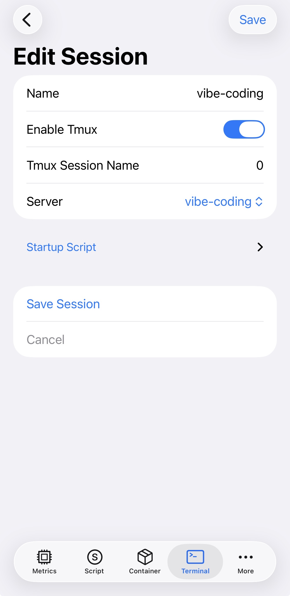

## An inevitable trend and parenting life
As the rise of LLM and its application on coding field, more and more developers are trying to code with the help of AI. The most used are Anthropic's Claude and Cursor, or similar tools. Some companies, for propaganda purpose, even claim that they are replace developers with AI. Despite the exaggeration, it's really time to test them and embrace them to boost our productivity.  Just yesterday, Mr. Karapathy tweeted about his own frustruation on catching up with the LLM trend, [The original tweet]( https://x.com/karpathy/status/2004607146781278521). For us developers, it's really a must to adapt to the new way of coding. Learning by using them it the best way.     
Meanwhile, with the kids, I cannot spend too much time on the computer. I need to find a way to vibe code on my phone, anywhere, anytime (waiting for the kids, on the bus, on the train, etc). So I started to explore how to make it possible.

## My experience on vibe coding
In my work, I have subscription of [Cursor](https://cursor.so/). I personnally subscribed to [Github Copilot](https://github.com/features/copilot) for a long time and tested both on VSCode and CLI. I also tested [Gemini-cli](https://cloud.google.com/gemini/docs/codeassist/gemini-cli), and breifly used [Claude Code](https://www.claude.com/product/claude-code).  
Recently, Github proposed their [Copilot Agent](https://docs.github.com/en/copilot/concepts/agents/coding-agent/about-coding-agent) which is to use LLM agent to write code and work on Github. All you need is to tell it what you want in the repo and it will create a PR with the code to be reviewed by you. It's really impressive. However I didn't really enjoy it because I can't deploy it to test without subscribe to [Github Spark](https://github.com/features/spark). Fine, I have to make my own vibe code environment.  
OpenAI made their effort to catch up with the trend. The recent released [Codex-CLI](https://developers.openai.com/codex/cli/) got hyped and I found GPT-5 Codex to GPT-5.2 Codex are very promising models. I tested and I can't be more satisfied. It's really a nice tool to make relatively good quality code. After several days of test, I decided to make it available everywhere, especially on my iPhone. I started to explore how to integrate it into my mobile workflow.   


## Vibe code on iPhone with Codex-CLI
The main idea is to use ssh to connect to a remote machine where Codex-CLI is installed. Then use a terminal app on iPhone to connect to it and vibe code everywhere. Simple as that. In reality, I want more than just typing and make it spit the code. I want to run the code and test the application. So a full development environment is needed. This is the workflow I came up with: 


### Step 1: Prepare a remote machine 
It could be any machine that you can ssh into. It could be a cloud VM, a home server, your laptop with no sleep configuration or even an old Android phone with Termux installed. The only requirement is that it should have Codex-CLI installed and configured for ssh access.
I just happened to have a bunch of Promox Machine lying around. I have cloud-init based VM templates ready to go. So I just created a new Ubuntu VM. With basic Python, NodeJS and Docker installed, it's ready for development.   
The additional step is to install Codex-CLI. You will need tmux or screen to keep the session alive when you disconnect from ssh.   
Alternatively, Docker is very good choice. Afterall, it's strongly advised to isolate Codex-CLI from the host system. You can easily find tragedies on X or reddit that LLM Cli tools mess up someone's system environment or even delete important data. For example: [⚠️ Warning: Gemini CLI Deleted My Entire Windows System](https://www.reddit.com/r/GeminiAI/comments/1md2quz/warning_gemini_cli_deleted_my_entire_windows/). If you are bold enough, Codex-CLI or other LLM CLI toosl implemented much stronger sandboxing mechanism to avoid such tragedies. But who wants the hassle of recovering a messed up system? 

### Step 2: Prepare iPhone terminal app
There are several terminal apps on iOS that support ssh, or something else if you are on Android. I personnally use [NeoServer: SSH Client|Terminal](https://apps.apple.com/us/app/neoserver-ssh-client-terminal/id6448362669) because I know the developper and I can get support from him. Other apps like [Termius](https://termius.com/) are also good choices. They are nothing more than the entrypoint for your workflow. Just install one of them and configure the ssh connection to your remote machine.   
The specialty of NeoServer is that it supports launch or attach to a tmux session directly when connecting to the remote machine. This is very useful because you can keep your coding session alive even when you disconnect from ssh and with one click to go back to the workspace. At the same time, it has a special tmux-optimized command mode to make it easier to use tmux on iPhone. 


### Step 3: prepare your coding environment  
The ubuntu VM is ready to use for most of the coding tasks, you just need to run `npm i -g @openai/codex` for Codex-CLI installation. Then run `codex auth login` to login to your OpenAI account and authorize Codex-CLI.
Codex's auth is kind of PITA, you need to ssh to your remote machine and use 
```bash
ssh -N -L 127.0.0.1:1455:127.0.0.1:1455 user@remote_machine
``` 
to forward the port for Codex-CLI to auth. Luckily it's oneshot, you just need to do it once. After that, you can use Codex-CLI normally. Checkout this issue for more details: [Support remote / headless OAuth sign-in #2798](https://github.com/openai/codex/issues/2798)

I personally use linuxbrew to manage my packages. It's very convenient to install different versions of NodeJS, Python, etc. You can also use nvm, pyenv or other version managers. Just make sure you have the right environment for your coding tasks.

Additionally, I suggest to get docker ready so that you can test your code in isolated containers in a detached manner with docker-compose. Since the Github Spark is paid only, this alternative is very useful to test web apps or other services while vibe coding.

### Step 4: Setup Codex-CLI 
Before using Codex-CLI, you need to setup your coding preferences. You can create a config file at `~/.codex/config.toml`.  I would like to share how I euip it. 
Firstly, it's useful to allow codex to search for issues/docs on the web. 
```toml
[sandbox_workspace_write]
network_access = true

[features]
web_search_request = true
```
You can find more options of security here [Docs for security](https://developers.openai.com/codex/security/). I didn't touch too much to keep a balance between security and usability.

MCPs are very useful these days, but we don't need too many of them. I just enable the most useful ones for me. [Install MCPs for Codex CLI](https://developers.openai.com/codex/mcp/)

```toml
[mcp_servers.chrome-devtools]
command = "npx"
args = ["chrome-devtools-mcp@latest", "--headless=true", "--isolated"]
enabled = true

[mcp_servers.context7]
command = "npx"
args = ["-y", "@upstash/context7-mcp"]
``` 
Where `chrome-devtools` is very useful for web development especially for smoke testing the web apps, and `context7` is a general purpose MCP that can access docs for libraries. You can add more MCPs as you need. Just make sure to read their documentation for proper configuration.


### Step 5: get yourself notified when Agent Run is done
When you are vibe coding, you may not want to stare at the terminal waiting for Codex-CLI to finish the task. If you are on desktop, the terminal can fire notification when the task is done. On iPhone, it's not that easy. I personnally use [ntfy](https://ntfy.sh/) service to send notification to my phone and it works with simple topic subscription. Just add this to your `~/.codex/config.toml` file:
```toml
notify = [
  "sh",
  "-c",
  "curl -s -o /dev/null -d \"Agent Turn Finished - $(date +'%H:%M')\" https://ntfy.sh/{your_topic}"
]
```
Now when you run an Agent task, you will get notified on your phone when it's done. Very convenient for vibe coding on the go. This command suppresses the curl output to avoid cluttering the terminal but simply tell you that it's your turn. 

### Step 6: Start vibe coding 
When everything is ready, you can start vibe coding on your iPhone. Just ssh into your remote machine with the terminal app, attach to your tmux session and start Codex-CLI. Don't forget to setup your Agents.md file for your project. You can frame the behavior of the agent with proper instructions. For example, you can tell the agent to write code, test code, dockerize the app, etc. Just like you are working on your desktop machine.   
You may also ask the agent to create Github Actions CI/CD workflows for your project. It's very useful to automate your deployment tasks. Just tell the agent what you want and it will create the necessary files for you. With this, you can even leverage the Github Actions to build your docker images and deploy them to your server automatically as long as you have proper secrets setup in your repo. 


### Extra step: Access the development server from your iPhone 
Not every family network gets public IP address. If you want to access your development server from outside, you may need to setup tailscale or Zerotier on your remote machine and iPhone. This way, you can access your development server securely from anywhere. Checkout [Tailscale](https://tailscale.com/) or [Zerotier](https://www.zerotier.com/) for more details. 

## UI design 
Although vibe coding on terminal is good enough, sometimes a better UI is needed. The Codex-CLI suggested figma MCP but as a Muggle in design, I am not comfortable to use it. But Google just released Stitch+(https://stitch.withgoogle.com/) which is a AI assisted UI design tool. Or simply ask Gemini with screen captures to get better UI design. It's well known that Gemini3 has strong capability in UI/UX design. You can leverage it to help you design better UI for your apps. Or you can run Gemini-cli to help you design UI components. Don't hesitate to leverage different models for different tasks. Some even use one CLI to manage multiple CLIs to get the best of each model, but I haven't tried that yet. 


## Wrap up
I used this method for 1 month, and I am quite satisfied with the experience. I successfully made a complex stack with several Vue.js frontends, FastAPI services and PostgreSQL(in docker for dev environment for sure, since no one should use a simple DB inside docker for production). The whole stack is dockerized and can be deployed with docker-compose. It comes with tests and CI/CD workflows to automate the deployment with the capability to smoke test the web apps with chrome-devtools MCP. 
I didn't squeeze every drop of productivity from vibe coding yet, but it's already a great help for my coding tasks while taking care of my kids. And I find that the current workflow took already all my spare energy even though it's not perfect yet.    
